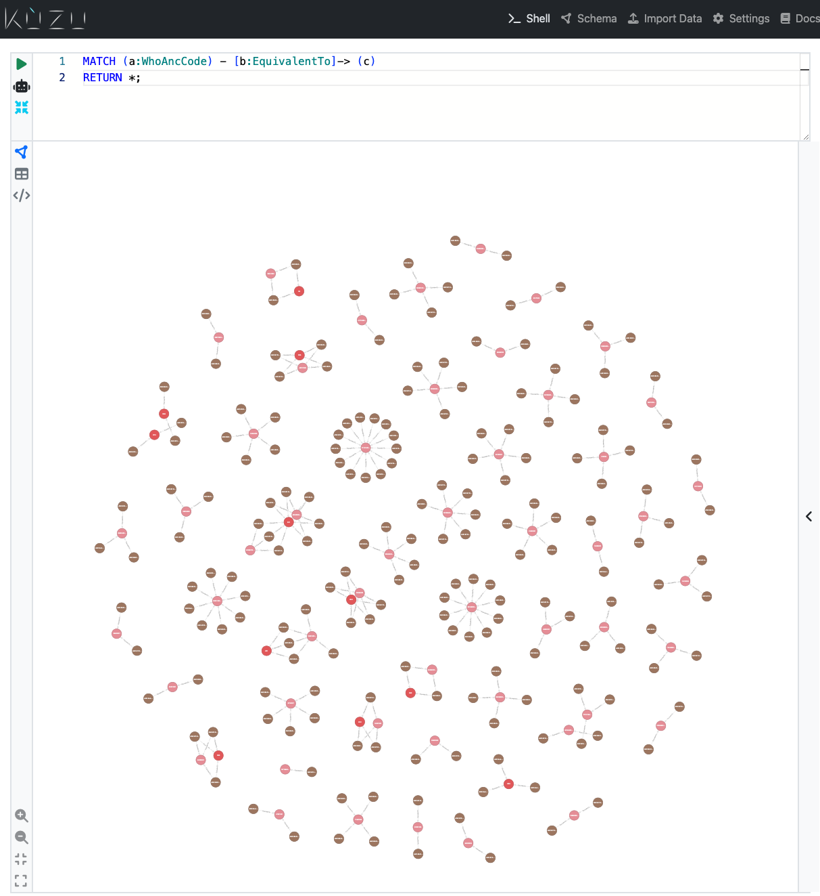
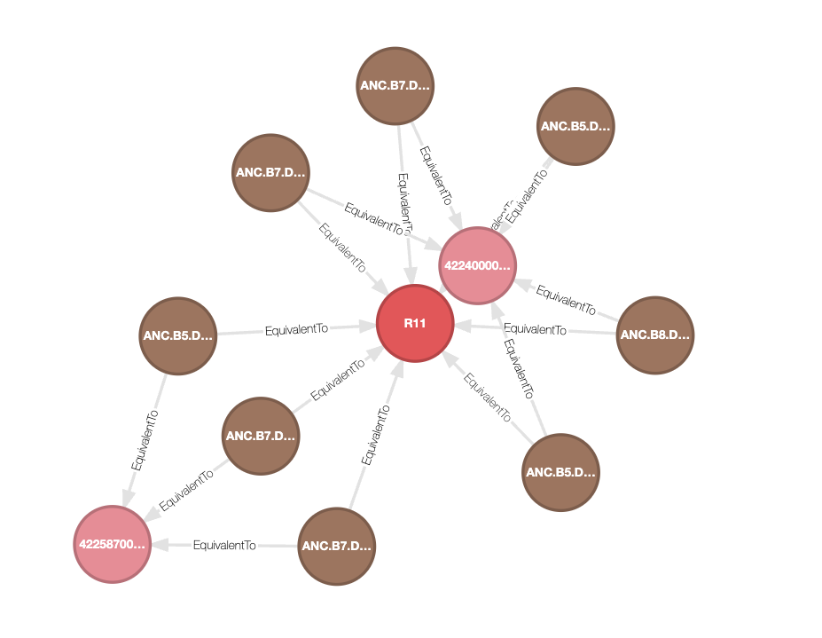
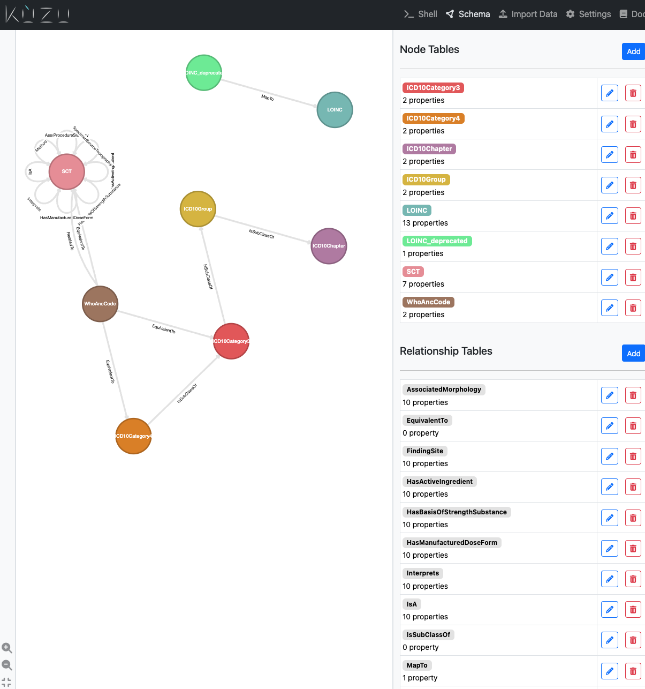

# FAIR with FHIR

Supplementary code for FAIR with FHIR paper, with the following demonstration notebooks:

- [profiles.ipynb](./profiles.ipynb) demonstrates the FHIR Profiling mechanism in Python, as an enabler for validating FHIR data in bulk
- [kumls.ipynb](./kumls.ipynb) demonstrates KUMLS, a lightweight UMLS knowledge graph database implemented in [Kùzu](https://kuzudb.com/)

## Using the KUMLS database

- Install Kùzu as described in the [documentation](https://docs.kuzudb.com/installation/)
- Download [`kumls.zip`](https://github.com/PharmAccess/fair-with-fhir/releases/tag/v0.1.0) and unzip the contents
- Run the [Kùzu Explorer](https://docs.kuzudb.com/get-started/cypher-intro/) with Docker

```shell
docker run -p 8000:8000 \
    -v /absolute/path/to/kumls:/database \
    --rm kuzudb/explorer:latest
```





